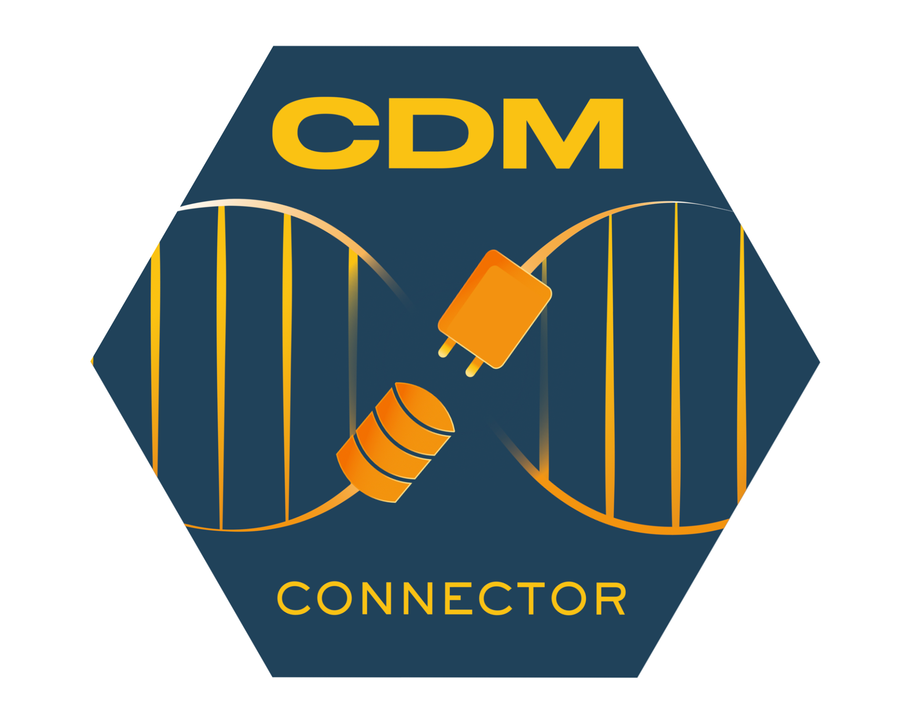

<!-- README.md is generated from README.Rmd. Please edit that file -->

# [CDMConnector](https://darwin-eu.github.io/CDMConnector/) 
 

<!-- badges: start -->
[](https://lifecycle.r-lib.org/articles/stages.html#stable)
[](https://CRAN.R-project.org/package=CDMConnector)
[](https://app.codecov.io/gh/darwin-eu/CDMConnector?branch=main)
[](https://github.com/darwin-eu/CDMConnector/actions?query=workflow%3AR-CMD-check)
[](https://github.com/darwin-eu/CDMConnector/actions?query=workflow%3Aduckdb-test)
[](https://github.com/darwin-eu/CDMConnector/actions?query=workflow%3Apostgres-test)
[](https://github.com/darwin-eu/CDMConnector/actions?query=workflow%3Asqlserver-odbc-test)
[](https://github.com/darwin-eu/CDMConnector/actions?query=workflow%3Aredshift-test)
[](https://github.com/darwin-eu/CDMConnector/actions?query=workflow%3Asnowflake-odbc-test)
<!-- badges: end -->


> Are you using the [tidyverse](https://www.tidyverse.org/) with an OMOP Common Data Model? 
>
> Interact with your CDM in a pipe-friendly way with CDMConnector.
>
> - Quickly connect to your CDM and start exploring.
> - Build data analysis pipelines using familiar dplyr verbs.
> - Easily extract subsets of CDM data from a database.


## Overview

CDMConnector introduces a single R object that represents an OMOP CDM relational database inspired by the [dm](https://dm.cynkra.com/), [DatabaseConnector](http://ohdsi.github.io/DatabaseConnector/), and [Andromeda](https://ohdsi.github.io/Andromeda/) packages. The cdm objects encapsulate references to [OMOP CDM tables](https://ohdsi.github.io/CommonDataModel/) in a remote RDBMS as well as metadata necessary for interacting with a CDM, allowing for dplyr style data analysis pipelines and interactive data exploration.


[](https://ohdsi.github.io/CommonDataModel/)

## Features

CDMConnector is meant to be the entry point for composable tidyverse style data analysis operations on an OMOP CDM. 
A `cdm_reference` object behaves like a named list of tables.

- Quickly create a list of references to a subset of CDM tables
- Store connection information for later use inside functions
- Use any DBI driver back-end with the OMOP CDM

See Getting started for more details.


## Installation

CDMConnector can be installed from CRAN:

```r
install.packages("CDMConnector")
```

The development version can be installed from GitHub:

```r
# install.packages("devtools")
devtools::install_github("darwin-eu/CDMConnector")
```

## Usage

Create a cdm reference from any DBI connection to a database containing OMOP CDM tables. Use the cdm_schema argument to point to a particular schema in your database that contains your OMOP CDM tables and the write_schema to specify the schema where results tables can be created, and use cdm_name to provide a name for the database.

```{r}
library(CDMConnector)

con <- DBI::dbConnect(duckdb::duckdb(dbdir = eunomiaDir()))

cdm <- cdmFromCon(con = con, 
                  cdmSchema = "main", 
                  writeSchema = "main", 
                  cdmName = "my_duckdb_database")
```

A `cdm_reference` is a named list of table references:

```{r, warning=FALSE, message=FALSE}
library(dplyr)
names(cdm)
```

Use dplyr verbs with the table references.

```{r}
cdm$person %>% 
  tally()
```

Compose operations with the pipe.

```{r}
cdm$condition_era %>%
  left_join(cdm$concept, by = c("condition_concept_id" = "concept_id")) %>% 
  count(top_conditions = concept_name, sort = TRUE)
```

And much more besides. See vignettes for further explanations on how to create database connections, make a cdm reference, and start analyzing your data.

```{r, include=FALSE}
cdmDisconnect(cdm)
```

## Getting help

If you encounter a clear bug, please file an issue with a minimal [reproducible example](https://reprex.tidyverse.org/) on [GitHub](https://github.com/darwin-eu/CDMConnector/issues).


## Citation

```{r, echo=FALSE, warning=FALSE}
citation("CDMConnector")
```


---

License: Apache 2.0


