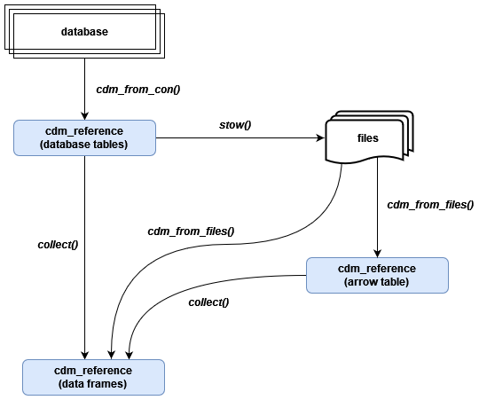

```{r, include = FALSE}
library(CDMConnector)
if (Sys.getenv("EUNOMIA_DATA_FOLDER") == "") Sys.setenv("EUNOMIA_DATA_FOLDER" = file.path(tempdir(), "eunomia"))
if (!dir.exists(Sys.getenv("EUNOMIA_DATA_FOLDER"))) dir.create(Sys.getenv("EUNOMIA_DATA_FOLDER"))
if (!eunomia_is_available()) downloadEunomiaData()

knitr::opts_chunk$set(
  collapse = TRUE,
  comment = "#>", 
  build = eunomia_is_available()
)
```


## Overview

The CDMConnector package allows us to work with cdm data in different locations consistently. The `cdm_reference` may be to tables in a database, files on disk, or tables loaded into R. This allows computation to take place wherever is most convenient. 

Here we have a schematic of how CDMConnector can be used to create `cdm_references` to different locations.

```{r pressure, echo=FALSE, out.width = '80%'}

```

## Example

To show how this can work (and slightly overcomplicate things to show different options), let´s say we want to create a histogram with age of patients at diagnosis of tear of meniscus of knee (concept_id of "4035415"). We can start in the database and, after loading the required packages, subset our person table people to only include those people in the condition_occurrence table with condition_concept_id "4035415" 

```{r, message=FALSE, warning=FALSE}
library(CDMConnector)
library(dplyr, warn.conflicts = FALSE)
library(ggplot2)
```

```{r, message=FALSE, warning=FALSE}
con <- DBI::dbConnect(duckdb::duckdb(), dbdir = eunomia_dir())
cdm <- cdm_from_con(con, cdm_schema = "main", cdm_tables = c("person", "condition_occurrence"))

# first filter to only those with condition_concept_id "4035415"
cdm$condition_occurrence %>% tally()

cdm$condition_occurrence <- cdm$condition_occurrence %>%
  filter(condition_concept_id == "4035415") %>%
  select(person_id, condition_start_date)

cdm$condition_occurrence %>% tally()

# then left_join person table
cdm$person %>% tally()
cdm$person <- cdm$condition_occurrence %>%
  select(person_id) %>%
  left_join(select(cdm$person, person_id, year_of_birth), by = "person_id")

cdm$person %>% tally()
```

We can save these tables to file
```{r, message=FALSE, warning=FALSE}
dOut <- tempfile()
dir.create(dOut)
CDMConnector::stow(cdm, dOut, format = "parquet")
```

And now we can create a `cdm_reference` to the files
```{r, message=FALSE, warning=FALSE}
cdm_arrow <- cdm_from_files(dOut, as_data_frame = FALSE)

cdm_arrow$person %>%
  nrow()

cdm_arrow$condition_occurrence %>%
  nrow()

```

And create an age at diagnosis variable
```{r, message=FALSE, warning=FALSE}
cdm_arrow$result <- cdm_arrow$person %>%
  left_join(cdm_arrow$condition_occurrence, by = "person_id") %>%
  mutate(age_diag = year(condition_start_date) - year_of_birth)
```

We can then bring in this result to R and make the histogram
```{r, message=FALSE, warning=FALSE}
result <- cdm_arrow$result %>%
  collect()

str(result)

result %>%
  ggplot(aes(age_diag)) +
  geom_histogram()
```

```{r}
DBI::dbDisconnect(con, shutdown = TRUE)
```


<div style="margin-bottom:3cm;"></div>
